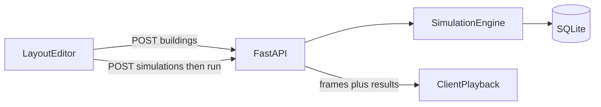

# How it works

A short mental model of the evacuation simulation app. For setup and run commands, see the [README](../README.md). For model limits, see [ASSUMPTIONS.md](ASSUMPTIONS.md).

**This tool estimates evacuation times from a simplified layout. It is not a safety certification or regulatory compliance calculation.**

## What this is

You sketch a floor plan in the browser (rooms, stairs, doors, exits, people), save it, and click **Run**. The server computes an evacuation timeline; the UI plays it back and shows summary stats (times, waits, congestion hotspots).

## Parts of the system

| Part | Role |
|------|------|
| **Editor** (React + Konva) | Draw and edit the layout; play animation frames |
| **API** (FastAPI) | Save buildings; create and run simulations |
| **Database** (SQLite) | Stores buildings and simulation snapshots, results, and frames as JSON |

## Building blocks

- **Spaces** — Closed polygons (rooms or stairs). Draw by clicking
  corners and closing on the first point. Centroid nodes define connectivity
  between openings; people do not walk to room centroids as waypoints.
- **Doors** — Connect two spaces. Clear opening width limits how many people
  fit through at once (body radius vs width).
- **Exits** — Attached to a space; people leave the building here (also
  width-limited).
- **Occupant groups** — A count of people in a space, with walking speed and optional preferred exit.

Under the hood, the simulator builds a **navigation graph**: space interior points
(connectivity / spawn), doors, exits, and reflex-corner waypoints. Openings that
share a space are linked only when the segment stays inside the polygon; otherwise
routes detour via waypoints. Occupants steer along those nodes, collide with each
other and with space-edge segments, and squeeze through openings.

## What happens when you click Run

1. **Save** — If the layout is dirty, the app saves the building first.
2. **Create simulation** — The API copies (snapshots) the current layout and parameters into a new simulation record (`ready`).
3. **Run engine** (server, all at once):
   - Build the navigation graph.
   - Expand each occupant group into individuals.
   - Assign each person a route to a viable exit. Without a preferred exit, the initial assignment weighs walking time from the spawn point against projected queues at every door and exit on viable routes. Alternate doors from the starting room are considered even when they lead to the same exit. A reachable preferred exit remains binding. Routes stay fixed for the run.
   - Step through time (default 0.25 s). At each step, everyone tries to move
     toward their next waypoint at once; body collisions, space edges, and door/exit widths
     create jams — excess demand means waiting outside the opening.
   - Record animation frames on an interval, then aggregate statistics (evac times, waits, hotspots).
4. **Playback** — The browser loads the returned frames and results, then animates locally (play / pause / speed / reset). Nothing streams live over the network.

## How to read results

- **Evacuation times** — Approximate travel time plus time spent waiting in
  crowds under the model’s rules (body collisions and opening width).
- **Wait / congestion hotspots** — Elements (doors, stairs, exits) where people queued.
- Treat numbers as planning estimates under simplified assumptions, not code-compliance evidence.

Full interpretation guidance: [ASSUMPTIONS.md](ASSUMPTIONS.md).

## Known simplifications

- Multi-floor tabs with stacked plans; linked stairs use a directed slowed climb between
  stair centers for multi-level pathing (not continuous vertical physics).
- Illustrative circular fire/flood/smoke (smoke expands faster than fire; both
  climb stairs then cascade down from the top floor); no panic or
  disability-specific movement.
- Space edges block movement except at door/exit widths; they do not carve the navigation graph.
- Occupants do not replan or follow crowds mid-run.

See [ASSUMPTIONS.md](ASSUMPTIONS.md) for the complete list.
