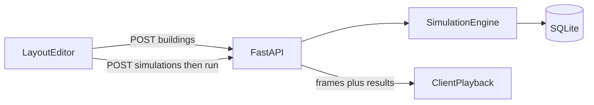

# How it works

A short mental model of the evacuation simulation app. For setup and run commands, see the [README](../README.md). For model limits, see [ASSUMPTIONS.md](ASSUMPTIONS.md).

**This tool estimates evacuation times from a simplified layout. It is not a safety certification or regulatory compliance calculation.**

## What this is

You sketch a floor plan in the browser (rooms, corridors, doors, exits, people), save it, and click **Run**. The server computes an evacuation timeline; the UI plays it back and shows summary stats (times, waits, congestion hotspots).

## Parts of the system

| Part | Role |
|------|------|
| **Editor** (React + Konva) | Draw and edit the layout; play animation frames |
| **API** (FastAPI) | Save buildings; create and run simulations |
| **Database** (SQLite) | Stores buildings and simulation snapshots, results, and frames as JSON |

## Building blocks

- **Spaces** — Axis-aligned rectangles: rooms, corridors, or stairs.
- **Doors** — Connect two spaces. Limited flow rate (people per second).
- **Exits** — Attached to a space; people leave the building here (also capacity-limited).
- **Occupant groups** — A count of people in a space, with walking speed and optional preferred exit.
- **Walls** — Drawn in the editor for clarity. They do **not** currently block paths; connectivity comes from spaces, doors, and exits only.

Under the hood, the simulator builds a **navigation graph**: space centroids, doors, and exits as nodes, linked by distance.

## What happens when you click Run

1. **Save** — If the layout is dirty, the app saves the building first.
2. **Create simulation** — The API copies (snapshots) the current layout and parameters into a new simulation record (`ready`).
3. **Run engine** (server, all at once):
   - Build the navigation graph.
   - Expand each occupant group into individuals.
   - Assign each person a **shortest path** to an exit (preferred exit if set, otherwise nearest by path length). Routes stay fixed for the run.
   - Step through time (default 0.25 s). At each step, people try to advance along their path; doors, stairs, exits, and dense corridors enforce capacity — excess demand means waiting.
   - Record animation frames on an interval, then aggregate statistics (evac times, waits, hotspots).
4. **Playback** — The browser loads the returned frames and results, then animates locally (play / pause / speed / reset). Nothing streams live over the network.

## How to read results

- **Evacuation times** — Approximate travel time plus time spent waiting in queues under the model’s rules.
- **Wait / congestion hotspots** — Elements (doors, corridors, stairs, exits) where people queued.
- Treat numbers as planning estimates under simplified assumptions, not code-compliance evidence.

Full interpretation guidance: [ASSUMPTIONS.md](ASSUMPTIONS.md).

## Known simplifications

- Single-floor style layout; stairs are capacity nodes, not multi-level physics.
- No fire, smoke, panic, or disability-specific movement.
- Walls do not carve the navigation graph.
- Occupants do not replan or follow crowds mid-run.

See [ASSUMPTIONS.md](ASSUMPTIONS.md) for the complete list.
